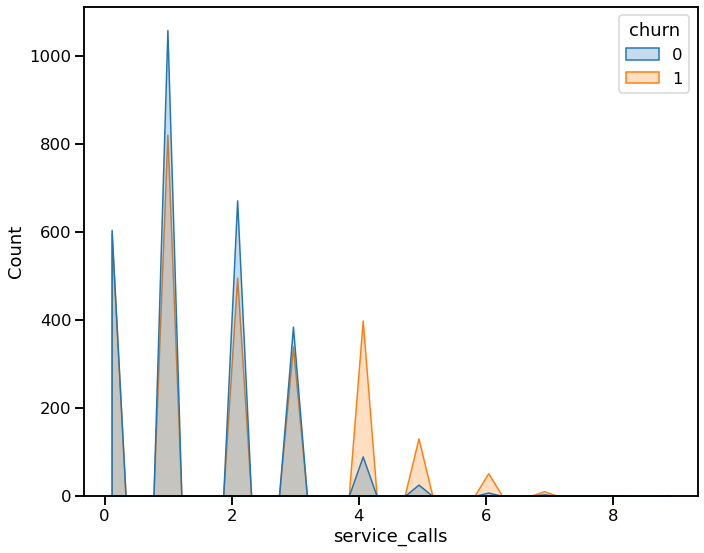

# SyriaTel Customer Churn Analysis

SyriaTel has identified that it is losing potential revenue by investing resources in short-term customers who will likely terminate their accounts with the company.  SyriaTel would like to give preferential treatment to its long-term customers, and therefore spend less money on the short-term customers.  But to do that effectively, it needs to accurately identify who the short-term customers are and distinguish them from the long-term customers.  Accordingly, it is looking for a classification model that can help it predict which customers are likely to be short-term customers.

## This Repository

### Repository Directory

```
├── README.md        <-- Main README file explaining the project's business case,
│                        methodology, and findings
│
├── data             <-- Data in CSV format
│   ├── processed    <-- Processed (combined, cleaned) data used for modeling
│   └── raw          <-- Original (immutable) data dump
│
├── model            <-- Final model
│
├── notebooks        <-- Jupyter Notebooks for exploration and presentation
│   ├── exploratory  <-- Unpolished exploratory data analysis (EDA) notebooks
│   └── report       <-- Polished final notebook
│
├── reports          <-- Generated analysis (including presentation.pdf)
│   └── figures      <-- Generated graphics and figures to be used in reporting
│   └── images       <-- Images used in reporting
│
└── src              <-- Relevant source code
```

### Quick Links

1. [Final Analysis Notebook](notebooks/report/final_notebook.ipynb)
2. [Presentation Slides](reports/presentation.pdf)

### Setup Instructions

To create a replica of the environment needed to run my notebook, run: 

conda env create --file churn.yml

## Data Understanding

SyriaTel has a dataset that includes a number of metrics regarding its customers, including how long they have been a customer, which plans they have, and how often and when they use SyriaTel's services.  SyriaTel is primarily concerned with not missing any short-term customers (i.e., minimizing false negatives).  Accordingly, recall is an important metric.  
  
However, it is also in SyriaTel's interest to accurately identify all long-term customers so that the company doesn't inadvertently treat a long-term customer like a short-term customer.  Thus it is important to minimize false positives, so precision is also an important metric.  
  
Since SyriaTel needs to minimize both false negatives and false positives, I used the F1 Score to develop my models.


## Model Development

Initially I investigated the relationship between various features and the target.  If I found any trends in the data, I segregated the data into bins to see if it improved model performance.  For details of my preprocessing steps, please review my [Feature Engineering notebook](notebooks/exploratory/Feature_Engineering.ipynb).
  
I then investigated five different classification models:  
    [Logistic Regression](notebooks/exploratory/Model1-LogisticRegression.ipynb)  
    [K-Nearest Neighbors (KNN)](notebooks/exploratory/Model2-KNN.ipynb)  
    [Decision Tree](notebooks/exploratory/Model3-DecisionTree.ipynb)  
    [Random Forest](notebooks/exploratory/Model4-RandomForest.ipynb)  
    [Gradient Boost](notebooks/exploratory/Model5-GradientBoost.ipynb)  
  
All models provided decent results for recall.  
  
Logistic Regression and KNN also provided decent results for accuracy, but were not good models for precision.  
  
Decision Tree and Random Forest provided good results for accuracy, and improved upon the precision scores from Logistic Regression and KNN, but their precision scores were still not satisfactory.  
  
Gradient Boost provided the best model.  It provided highly accurate classifications, and it provided good results for precision.  Since I used the same random_state value throughout my modeling, I [tested the Gradient Boost model](notebooks/exploratory/Test_Gradient_Boost.ipynb) using a different random_state, and found that it provided highly accurate classifications, provided fairly high results for precision and decent results for recall. I therefore proceeded with my Gradient Boost model.

## Evaluation

As shown below, my model provided highly accurate classifications, good results for precision, and decent results for recall.
Test Accuracy: 0.96
Test Recall: 0.79
Test Precision: 0.91


The bar chart below depicts the important features in my model


There was a notable difference between the top 3 important features during the exploratory data analysis ("EDA").  As shown below, there is a clear distinction between long-term customers and short-term customers in terms of the number of minutes they use their cell service during the day  the number of service calls they make  and the number of international calls they make 


## Conclusion

I created a Gradient Boost model that classifies long-term customers vs. short-term customers fairly accurately.  
  
The model classifies long-term customers better than short-term customers (i.e., precision score is better than recall).

## Next Steps
Discuss how SyriaTel intends to reduce spend on short-term customers to determine if model should be tweaked to increase recall and decrease precision.  
  
I recommend investigating the important features further to determine if we can improve the model.  The important features includes:
- The number of minutes the customer uses the phone services during the day
- The number of service calls the customer makes
- The customer's international plan 